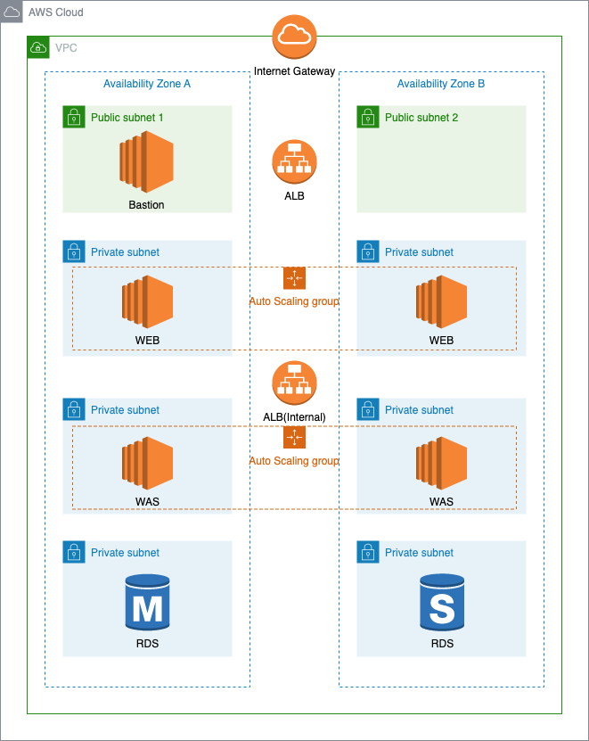

# Terraform AWS 3-tier (이미지 변경 필요)

## 생성되는 리소스
* VPC
* Subnet
* RouteTable
* EIP
* Internet Gateway
* Security Group
* Nat Gateway
* EC2 (bastion)
* ALB
* Auto Scaling Group
* Application Load Balancer
* RDS
